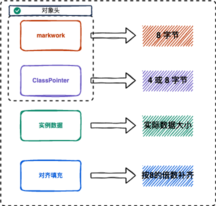

# Object Memory Layout

Object instance = new Object(); 在内存中占用多少字节？

> new Object() 占用16字节，instance 占用4字节

在HotSpot虚拟机中，对象在内存中布局为对象头，实例数据和对齐填充三个区域，其中对象头包括 MarkWork 和 ClassPointer 两部分。下面主要介绍 64 位 JVM。



- MarkWork 标记字段，占用8个字节，主要记录锁状态（无锁，偏向锁，轻量级锁，重量级锁标识），hashCode, GC分代年龄。

- ClassPointer 类指针，指向对象的Class的内存地址。内存占用是默认开启字节压缩-XX:+UseCompressedClassPointers -XX:+UseCompressedOops, 开启时占用4字节，关闭时占用8字节。

  > 如果对象为数组时，对象头还包括数组长度Length，占用4个字节或8个字节，记录数组长度。

- InstanceData 对象实例数据，占用空间是对象所有成员变量所占用空间和。

- padding 对齐填充，补齐整体占用空间大小被8整除，因 HotSpot JVM 的自动内存管理系统要求对象起始地址必须是8字节的整数倍。

`JOL`(JAVA OBJECT LAYOUT)包可以查看一个 Java对象的内存布局及占用多少字节

```java
<dependency>
    <groupId>org.openjdk.jol</groupId>
    <artifactId>jol-core</artifactId>
    <version>0.16</version>
    <scope>provided</scope>
</dependency>

// 打印 Java 对象内存布局
ClassLayout.parseInstance(new Object()).toPrintable();

java.lang.Object object internals:
 OFFSET  SIZE   TYPE DESCRIPTION        VALUE
      0     4        (object header)    01 00 00 00 (00000001 00000000 00000000 00000000) (1)
      4     4        (object header)    00 00 00 00 (00000000 00000000 00000000 00000000) (0)
      8     4        (object header)    e5 01 00 f8 (11100101 00000001 00000000 11111000) (-134217243)
     12     4        (loss due to the next object alignment)
Instance size: 16 bytes
Space losses: 0 bytes internal + 4 bytes external = 4 bytes total
```

- **OFFSET**:从第几个位置开始
- **size**:大小，单位字节，
- **TYPE DESCRIPTION**：类型描述，object header为对象头，前两行为markwork，第三行为classpointer。
- **VALUE**：值
- **loss due to the next object alignment**:  对齐填充

**基础类型占用空间**

|         | 占用（字节） | 默认值   |
| ------- |:------:|:-----:|
| byte    | 1      | 0     |
| short   | 2      | 0     |
| int     | 4      | 0     |
| long    | 8      | 0L    |
| char    | 2      | 0     |
| float   | 4      | 0.0f  |
| double  | 8      | 0.0d  |
| boolean | 1      | false |

**Sample**

1.Integer[] 占用内存多少字节

   > markwork=8字节，classpointer占用4字节，数组长度占用4字节，Integer 内部int 变量value占用4字节，在填充4字节对齐，一共占用24字节。
