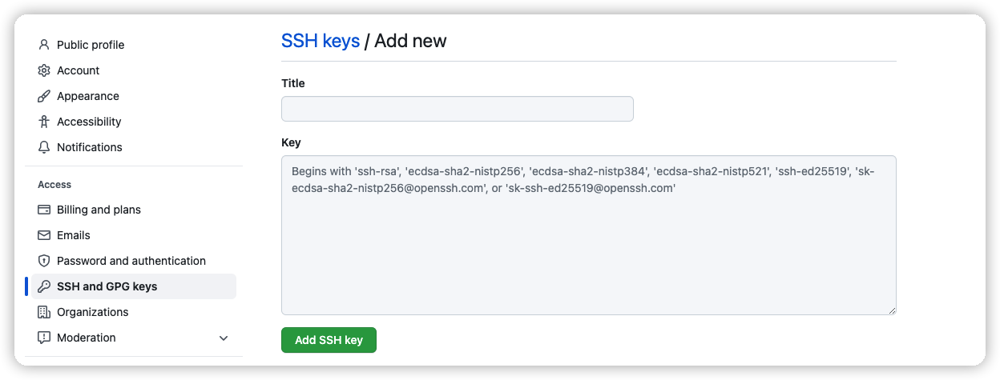

# Configure Multiple SSH keys

本机同时配置多个代码托管平台的 SSH 免密，如：在一个机器上要同时 SSH 免密访问 github、gitlab 平台上项目。

## 生成私钥公钥

```shell

ssh-keygen -t rsa -f ~/.ssh/id_rsa_github -C "xxx@163.com"

# 操作其他账号
ssh-keygen -t rsa -f ~/.ssh/id_rsa_aliyun -C "xxx@163.com"
```

## 添加Config文件

```shell
vim ~/.ssh/config
```

config文件内容:

```text
## github key
Host github.com
    HostName github.com
    PreferredAuthentications publickey
    IdentityFile ~/.ssh/id_rsa_github

## other key
Host xxx
    HostName xxx
    PreferredAuthentications publickey
    IdentityFile ~/.ssh/id_rsa_xxx

```

| name                     | description                                                     |
|--------------------------|-----------------------------------------------------------------|
| Host                     | git连接的Host，github.com --> git@github.com:MetaHut/code-works.git |
| HostName                 | 域名                                                              |
| PreferredAuthentications | 配置登录时限认证，可设为publickey,password publickey,keyboard-interactive   |
| IdentityFile             | id_rsa文件，如：~/.ssh/id_rsa_github                                 |


## 配置平台 SSH 免密

复制 `~/.ssh/id_rsa_*.pub` 文件内容到对应的平台配置 ssh-key，上面第一步生成的私钥公钥都需要操作。

例如：Github

右上角头像 --> Settings --> SSH and GPG keys --> New SSH key



复制 `~/.ssh/id_rsa_*.pub` 文件内容到key输入框，Title 随意填写 --> Add SSH key

* 本地测试验证SSH免密

    ```shell
    ssh -T git@github.com
    ```
    返回信息
    ```text
    Hi Kerwin! You've successfully authenticated, but GitHub does not provide shell access.
    ```

## 配置全局账号

建议将常用的配置为全局的，不常用的配置为local

* 配置全局 

    1.查看
    ```shell
    git config --global --list
    ```
    2.配置
    ```shell
    git config --global user.name "Kerwin"
    git config --global user.email "******@163.com"
    ```

* 配置local，

  **每次拉取或创建新项目后，都需要配置local账号，local配置仅在这个项目下有效。**

  1.查看
    ```shell
    git config --local --list
    ```
  2.配置
    ```shell
    git config --local user.name "Kerwin"
    git config --local user.email "******@163.com"
    ```
